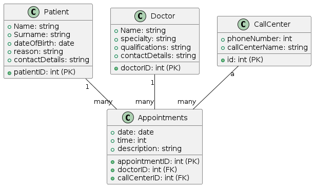

# Proiect programare doctor

## Obiective

Obiectivele acestui proiect sunt:

- Folosirea unei baze de date pentru a ține în memorie anumite informații legate de pacienți:
  1. Nume și prenume
  2. Data nașterii
  3. Fișă medicală
  4. Adresă
  5. Date de contact (telefon)

- Folosirea unei conexiuni la baza de date prin intermediul lui Singleton într-o clasă.
- Crearea unei clase numite "Pacient" cu atributele necesare.
- Crearea unei clase numite "Doctor" cu atributele necesare.
- Crearea unei clase numite "Call Center" cu atributele necesare: număr de telefon, nume call center.
- Se va folosi modelul MVC.
- Controller pentru interacțiuni între cele 3 modele.
- Se va folosi arhitectura top-bottom în care avem servicii ca intermediari pentru controller.
- Crearea unui frontend în React.
  - Crearea unui tabel pentru doctori.
  - Fiecare doctor are atribute: ID, nume, specializare, orele între care lucrează și datele de contact: adresă locului unde își prestează serviciile, telefon și email.

- Crearea unui observer, subject și logger pentru a putea face posibil pattern-ul observer.
- Realizarea unor comentarii în Javadoc.

## ENDPOINTS

### 1. Appointments

#### GET: Retrieve all appointments
- **Endpoint:** `/appointments`
- **Method:** GET
- **Description:** Retrieves a list of all appointments.

#### POST: Add a new appointment
- **Endpoint:** `/appointments`
- **Method:** POST
- **Description:** Adds a new appointment.

#### PUT: Update an existing appointment
- **Endpoint:** `/appointments/{id}`
- **Method:** PUT
- **Description:** Updates an existing appointment specified by its ID.

#### DELETE: Delete an appointment by ID
- **Endpoint:** `/appointments/{id}`
- **Method:** DELETE
- **Description:** Deletes an appointment specified by its ID.

### 2. Doctor

#### GET: Retrieve all doctors
- **Endpoint:** `/doctors`
- **Method:** GET
- **Description:** Retrieves a list of all doctors.

#### POST: Add a new doctor
- **Endpoint:** `/doctors`
- **Method:** POST
- **Description:** Adds a new doctor.

#### PUT: Update an existing doctor
- **Endpoint:** `/doctors/{id}`
- **Method:** PUT
- **Description:** Updates an existing doctor specified by its ID.

#### DELETE: Delete a doctor by ID
- **Endpoint:** `/doctors/{id}`
- **Method:** DELETE
- **Description:** Deletes a doctor specified by its ID.

### 3. Patient

#### GET: Retrieve all patients
- **Endpoint:** `/patients`
- **Method:** GET
- **Description:** Retrieves a list of all patients.

#### POST: Add a new patient
- **Endpoint:** `/patients`
- **Method:** POST
- **Description:** Adds a new patient.

#### PUT: Update an existing patient
- **Endpoint:** `/patients/{id}`
- **Method:** PUT
- **Description:** Updates an existing patient specified by its ID.

#### DELETE: Delete a patient by ID
- **Endpoint:** `/patients/{id}`
- **Method:** DELETE
- **Description:** Deletes a patient specified by its ID.
